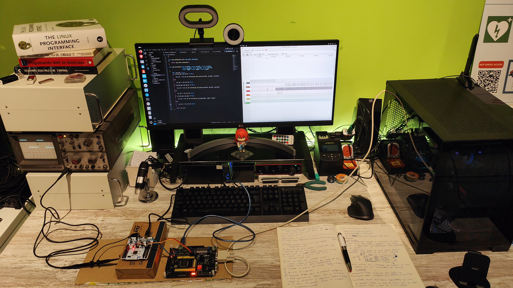

# Hi, I'm AritzElge 🛠️🛰️
### Industrial Electronics & Automation Engineer | Critical & Deterministic Embedded Systems Specialist | Firmware Hardening & Safety-Critical Design

I design and build solutions where **determinism**, **safety**, and **reliability** are non-negotiable. My engineering approach bridges the gap between robust analog physics and high-performance digital logic, working natively in Linux/POSIX environments for mission-critical applications.

## 🔬 Engineering Laboratory (2026 Setup)

*Current workstation optimized for low-level development, high-speed signal validation, and deterministic benchmarking (feat. **Kita** as the system 'validation' assistant).*

### Laboratory Capabilities:
- **Precision Soldering:** **JBC** Soldering Station (Industry standard for mission-critical joints).
- **Data Acquisition:** **NI USB-6211** (DAQmx integration for precise sensor characterization and validation).
- **Signal Analysis:** **Hameg HM203** Analog Oscilloscope (Real-time transient capture without digital aliasing).
- **Programmable Logic:** Custom Logic Analyzer based on **Cyclone IV FPGA** (High-speed hardware-level debugging).
- **Safety & Integrity:** Full **ESD-safe** environment and galvanic USB isolation for host PC protection.

## 🚀 Featured Projects

### 🛸 [ATOP](https://github.com/AritzElge/ATOP)
A high-reliability micro-kernel library designed for flight control loops and deterministic execution.
- **Safety & Standards:** Developed following **NASA** and **MISRA-C** guidelines (including formally documented deviations for function pointer usage).
- **Validation Framework:** Architected for **SITL (Software-In-The-Loop)** and **HITL (Hardware-In-The-Loop)** testing.
- **Design Pattern:** Utilizes function pointers for hardware abstraction and dependency injection, enabling rigorous unit testing and modularity.
- **Interoperability:** Native **C** implementation with `extern "C"` for seamless **C++** integration.

### 🏠 [ELI_galileo](https://github.com/AritzElge/ELI_galileo)
A POSIX-compliant master Linux Embedded system for home automation running on legacy **Intel Galileo Gen2** hardware.
- **Architecture:** Hybrid C, Shell Scripting, and Python (actively refactoring Python logic to C for resource optimization).
- **Reliability:** Implements **Modbus** protocol for industrial-grade communication over Linux-embedded environments.

## 🛠️ Technical Stack & Expertise

- **Safety-Critical:** MISRA-C compliance, NASA software standards, Hard Real-Time determinism.
- **Microcontrollers/SoC:** STM32 (including **STM32MP1** Dual-Core), ESP32-C3, Intel Galileo, AVR, PIC.
- **FPGAs:** Digital Logic Design in **VHDL** (Intel/Altera Cyclone series).
- **OS/Kernel:** Native **Ubuntu** development, advanced **Linux Programming Interface (POSIX)**.
- **Languages:** C (Primary), Python (Automation/Refactoring), VHDL, Shell Scripting.

## 📚 Core Reference Bookshelf
My design decisions are backed by industry-standard literature:
- *The Linux Programming Interface* (M. Kerrisk) – POSIX and Kernel interaction.
- *Better Embedded System Software* (Philip Koopman) – Software safety and reliability.
- *Practical C Programming* (Drappier & Mauffrey) – Robust firmware design.

## 📈 Roadmap for 2026
- [ ] Release **ATOP** v1.0.0.
- [ ] Reach v1.0.0 in **ELI_galileo**.
- [ ] **VHDL Mastery:** Complete the development of the **FPGA_Logic_Analyzer_Lite** for real-time signal capture.
- [ ] Deploy 6-DOF robotic control on **STM32MP1** (future Stäubli RX60 integration).

📫 **Contact info** 

- Email: aelguezabal010@gmail.com

- GitHub: [https://github.com/AritzElge](https://github.com/AritzElge)

- LinkedIn: [Link to my LinkedIn](https://www.linkedin.com/in/aritzelge/)
